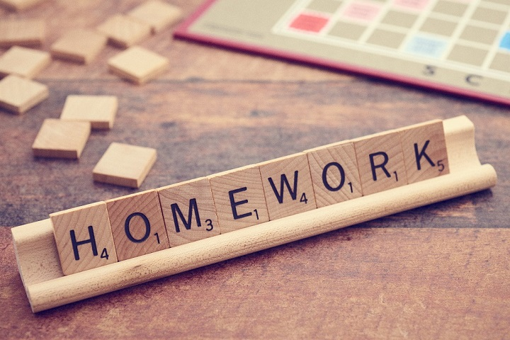

# #100DaysOf
Keep track of my 100 days of learning/code challenge.

## Challenge Logs
* [Round 1 (Learning)](round01/README.md): July 18th, 2022 - In Progress 
Topics: Artificial Intelligence/Mathematics/Python
## Rules for each round
1. Code minimum an hour every day for the next 100 days.
2. Tweet progress every day with the #100DaysOfCode hashtag.
3. The hour will not be counted at work **but** it will be counted for time spent on pure learning or solving problems on dedicated platforms ([Codingame](https://codingame.com) or [Kaggle](https://kaggle.com) by example).
 
## Personalization
The official #100DaysOfCode challenge normally:
* Doesn't count time spent on reading tutorials, or going through examples. \
But the most important, for me, is the progress by learning **and** coding.
* Require to tweet progress every day: I'll tweet only when I'll finish a project, or if I have relevant content.
  

<a href="https://stocksnap.io/photo/homework-text-SNCWBRB3C3">Photo</a> by <a href="https://stocksnap.io/author/wordpics">Words as Pictures</a> on <a href="https://stocksnap.io">StockSnap</a>
